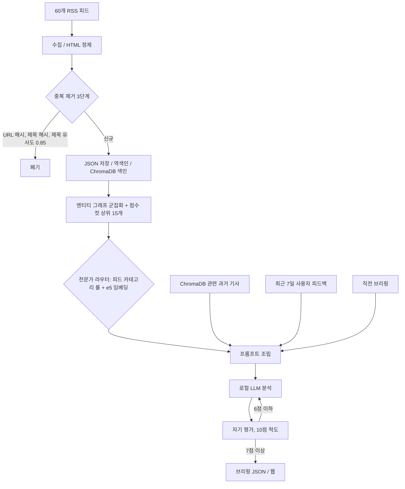

# mini-MoE News Briefing

RSS 피드 60개를 모아 테마로 묶고, 테마마다 분야별 시스템 프롬프트("전문가")를 골라 로컬 LLM으로 분석하는 뉴스 브리핑 시스템이다. 하루 8번 돈다. 그날 두 번째 실행부터는 직전 브리핑을 이어받아 바뀐 테마 위주로 다시 쓰고, 생성 결과를 같은 모델로 채점해 점수가 낮은 테마만 재생성한다.

English: A self-hosted news briefing system. It collects about 60 Korean/English RSS feeds, groups articles into themes, and routes each theme to a domain-specific system prompt using feed-category rules plus an embedding check. Everything runs on a local LLM through Ollama, with no external API calls. I have run it alone as a live service since March 2026: 1,363 collection cycles, 628,971 articles stored, over 10,000 local LLM calls. Much of the code was written with Claude Code; the "AI와 작업한 방식" section covers how I checked that code against the source and the logs.

- 스택: Flask, APScheduler, ChromaDB, Ollama(`qwen3.6:35b-a3b`), `intfloat/multilingual-e5-small`
- 운영: 1인 개발, macOS launchd로 상시 기동, 2026-03부터 운영 중
- 더 보기: [docs/TRACE_EXAMPLE.md](docs/TRACE_EXAMPLE.md)(기사 10건이 브리핑 한 꼭지가 되는 과정), [docs/CODE_WALKTHROUGH.md](docs/CODE_WALKTHROUGH.md)(실행 순서, 튜닝 포인트, 로그 읽는 법), [docs/AI-COLLABORATION.md](docs/AI-COLLABORATION.md)(AI 작업 기록), [eval/](eval/)(라우팅 정확도 골드셋)

## 왜 만들었나

시황을 볼 때는 그날 들어온 기사 1,000건을 다 읽기보다 직전과 비교해 달라진 흐름 15개 정도를 보고 싶었다. 쓰던 뉴스 앱과 범용 요약 도구는 매번 전체를 새로 요약해서 같은 사건이 매번 새 사건처럼 나왔고, 증권 기사와 국제 정세 기사를 같은 톤으로 요약했다. 그래서 직전 브리핑과 과거 기사를 컨텍스트로 넣고, 테마마다 분야별 프롬프트를 고르게 만들었다.

## 구조



크론과 수동 트리거 모두 `scheduler.py`의 `collect_and_analyze()` 하나로 들어온다. 그날 브리핑이 없으면 전체 분석, 있으면 증분 분석으로 간다. 웹 서버와 스케줄러가 한 프로세스다.

## 풀어 본 문제

### 룰과 임베딩을 섞은 전문가 라우팅

피드의 `category` 라벨은 매체마다 정확도가 다르다. 룰만 쓰면 라벨이 엉성한 매체에서 틀리고, 임베딩만 쓰면 라벨이 확실한 경우까지 흔들린다. 그래서 룰을 기본으로 두고, 임베딩 1위가 룰 후보보다 마진 이상 높을 때만 뒤집는다. `general`이나 빈 라벨은 임베딩에 맡긴다([router.py](analyzers/experts/router.py)).

마진은 처음 0.04였는데 운영 로그에서 뒤집힌 건이 0건이라 룰만 쓰는 것과 같았다. 0.025로 내린 뒤 2026-06-05 ~ 09-17의 5,692건 판정은 룰 69.2%, 저신뢰 라벨이라 임베딩 22.6%, 임베딩이 뒤집음 8.2%였다. 가장 자주 교정되는 건 `economy` 라벨이었다(`stocks`로 77건). 뒤집은 게 맞았는지는 아직 모른다. 그걸 재려고 층화 표집 200건 골드셋을 만들었고 라벨링 중이다([eval/](eval/)).

### 증분 분석

9월 기준 사이클 소요 시간이 중앙값 39분이라 매번 전체를 다시 분석하면 하루 8회를 못 맞춘다. 그날 첫 사이클만 전체 분석하고, 이후에는 직전 브리핑 테마를 엔티티 역색인에 올려 두고 새 기사를 매칭한다. 새 기사가 3건 이상 붙은 테마만 다시 쓰고, 어디에도 안 붙은 기사가 3건 이상이면 그것끼리 새 테마를 최대 5개 만든다.

로그로 확인해 보니 매칭률은 2.3%였다. 유지되는 테마가 15개뿐이라 사이클당 400건대 신규 기사가 대부분 기존 테마에 안 붙는다. 3건 문턱 때문에 서술이 그대로인 테마가 연속 브리핑에 반복되기도 한다. 2026-09-16의 한 테마는 브리핑 6개에 실렸는데 새로 쓰인 건 3번이었다([TRACE_EXAMPLE](docs/TRACE_EXAMPLE.md)).

### 자기 평가와 사실 판단 금지

로컬 모델이 가끔 내용 없는 상투적 서술을 낸다. 같은 모델로 서술 품질을 10점 척도로 채점하게 하고 6점 이하만 재생성한다. 처음에는 평가 모델이 학습 데이터에 없는 최신 사건을 "사실이 아님"으로 보고 멀쩡한 테마를 깎았다. 평가 프롬프트에 사실 여부는 판단하지 말고 기사대로 믿으라고 적고, 원본 기사 제목을 같이 넣었다. 평가 244회에서 점수 중앙값은 7.0, 24.2%가 6점 이하였다.

### LLM 출력 후처리

로컬 모델의 실패는 몇 가지 패턴이 반복됐다. 고유명사 한영 혼용(`'베irut'`), 중국어와 일본어 혼입, 코드펜스나 설명문이 붙은 JSON 같은 것들이다. 프롬프트로 먼저 막고 [ollama_client.py](analyzers/ollama_client.py)에서 한 번 더 거른다. 2자 이상 연속 한자와 가나가 섞인 토큰을 지우고(`美`, `韓` 같은 1자 약칭은 남긴다), think 태그와 코드펜스를 벗긴 뒤 JSON 블록만 꺼낸다. 테마 분석, 종합, 재생성, 평가를 합친 호출 10,492회 중 JSON 파싱이 끝내 실패한 건 313회(2.98%)다. 주어와 목적어가 뒤바뀌는 오류는 후처리로 못 잡아서 프롬프트로만 막고 있다.

### 싼 순서대로 거르는 중복 제거

URL 해시만으로는 매체 간 재배포를 못 잡고, 누적 60만 건 전체와 문자열 유사도를 비교할 수도 없다. URL 해시, 제목 해시, 제목 유사도(0.85) 순으로 거르고, 유사도 비교만 최근 5,000건으로 제한했다([dedup.py](collectors/dedup.py)). 한 사이클에 읽는 원본 중앙값 2,749건 중 406건이 남는다. 피드가 최근 기사를 매번 다시 내보내는 영향이 크다.

그 밖에 한 시간 넘는 사이클이 다음 크론과 겹치지 않도록 논블로킹 락을 걸었고, 수동 수집 엔드포인트(`/api/collect/now`)는 비밀번호가 설정되지 않으면 항상 거부한다.

## 운영 수치

운영 로그(2026-03-10 ~ 09-17)와 브리핑 JSON을 집계한 값이다.

| 항목 | 값 |
|---|---|
| 완료된 수집 사이클 | 1,363회 |
| 누적 신규 저장 기사 | 628,971건 |
| 사이클당 신규 기사 (중앙값) | 406건, 폐기율 84.2% |
| 사이클 소요 시간 (전 기간) | 중앙값 18.3분, 최대 187.3분 |
| 브리핑 | 테마 15개, 테마당 기사 중앙값 6건 |
| LLM 호출 (병합 관련 제외) | 10,492회 |
| JSON 파싱 최종 실패 | 313회 (2.98%) |

## AI와 작업한 방식

코드 상당 부분을 Claude Code로 작성했다. 처음에는 바이브 코딩에 가까웠고, 이후로 신경 쓴 건 AI가 쓴 코드와 문서를 그대로 믿지 않고 코드와 로그에 대조하는 일이었다. 세션이 끝나면 맥락이 사라지니 원본 저장소의 `CLAUDE.md`에 세션 시작 때 최근 작업 메모를 읽고 끝날 때 새 메모를 남기게 했다.

대조해서 잡은 것들:

- AI가 쓴 현황 메모에는 "LoRA를 얹은 gemma가 브리핑을 생성한다"고 되어 있었다. 런타임 코드를 grep해 보니 어댑터 로딩 경로가 없었다. 지금 구조는 프롬프트 단위 MoE라고 고쳐 적었다.
- README 문장을 다듬다가 코드와 맞춰 보니 4건이 틀려 있었다(중복 제거 단계 수, ChromaDB 용도, 라우터 폴백 유무, `.env.example` 변수 목록). 쓰이지 않던 모듈 2개와 템플릿 3개도 이때 지웠다.
- 6개월치 로그를 집계했더니 군집화와 증분 매칭이 설명대로 동작하지 않았다. 결과는 쓸 만하지만 이유가 달라서 위 설명과 한계 항목에 그대로 적었다.
- 공개용 저장소를 새로 받아 한 사이클 돌려 보다가, 외장 스토리지 없이 띄우면 사이클 시작 때 로컬 ChromaDB를 지우는 버그를 찾아 고쳤다. 운영 환경은 늘 외장이 붙어 있어서 드러나지 않았다.
- 외부 노출 점검 중에는 AI가 로그를 두 번 잘못 읽었다(자기 도구의 출구 IP를 외부 스캐너로 봄). 같은 점검에서 인증 없이 열려 있던 수동 수집 엔드포인트를 찾아 막았다.

서비스 코드는 git 밖에서 개발해서 3월부터의 과정을 커밋으로 재구성할 수 없다. 이 저장소는 공개용으로 정리한 스냅샷이다. 메모 자체도 AI가 썼고, 방향 전환은 대화 중에 해서 남아 있지 않다. 자세한 건 [docs/AI-COLLABORATION.md](docs/AI-COLLABORATION.md), 같은 방식을 다른 프로젝트에서 정리한 건 [MindFlow 케이스 스터디](https://github.com/thefirstplum/mindflow-case-study)에 있다.

## 실행

```bash
git clone https://github.com/thefirstplum/news-briefing.git && cd news-briefing
python -m venv .venv && source .venv/bin/activate
pip install -r requirements.txt

cp .env.example .env      # 값 설정
ollama pull qwen3.6:35b-a3b

python app.py             # http://localhost:3400
```

처음 띄울 때 e5 임베딩 모델을 Hugging Face에서 받는다. Ollama가 꺼져 있어도 웹과 수집은 돌고 분석만 건너뛴다. `NEWS_STORAGE_PATH`를 비워 두면 데이터는 `data/` 아래에 쌓인다. 수동 수집은 `.env`의 `NEWS_COLLECT_PW`로 인증한다.

```bash
curl -X POST -H "X-Collect-Password: <비밀번호>" http://localhost:3400/api/collect/now
```

`scripts/`의 LoRA 학습 스크립트는 MLX(Apple Silicon)가 필요하고, 파이썬 경로는 `PYTHON` 환경변수로 넘긴다(기본 `python3`).

```
├── app.py              Flask 라우트, 수동 수집 인증, 피드백 API
├── scheduler.py        크론, 수집 사이클, 중복 실행 락
├── config.py           RSS 피드 60개, 카테고리, 런타임 설정
├── collectors/         피드 파싱, 중복 제거
├── analyzers/          군집화, 증분 분석, 자기 평가, LLM 클라이언트
│   └── experts/        라우터, e5 임베딩, 전문가 9개 프롬프트
├── storage/            JSON 저장, 역색인, ChromaDB
├── eval/               라우팅 정확도 골드셋, 채점 스크립트
└── scripts/            LoRA 학습 데이터 생성, 파인튜닝 (런타임 미연결)
```

## 알려진 한계

- LoRA 어댑터는 학습까지만 했다. `stocks` 어댑터(rank 8, 13MB)를 만들었지만 런타임에 로딩 코드가 없다. 지금은 가중치는 그대로 두고 프롬프트만 바꿔 끼우는 구조다.
- 군집화가 거의 묶지 못한다. 548건이 493개 군집으로 나온 날도 있다. 실제 선별은 기사 수, 카테고리 가중치, 매체 수로 매긴 점수 컷이 한다. 군집화는 기사 쌍 전수 비교(O(n²))라 수집량이 늘면 병목이 된다.
- 라우팅 정확도를 아직 못 쟀다. 전문가 대표벡터도 손으로 쓴 문구의 평균이라 실제 기사 centroid로 바꾸는 게 맞다.
- 자동화 테스트가 없다. 고치면 한 사이클 돌려 보고 로그로 확인한다. 카테고리 가중치나 Jaccard 0.25 같은 숫자는 근거 기록이 없다.
